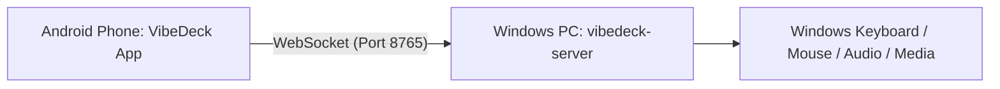

<div align="center">

# 🎛️ VibeDeck

### **Next-Gen Cyberpunk Stream Deck, Remote Trackpad & PC Controller**

*Zero Latency. Zero Cloud Dependency. 100% Free & Open-Source.*

[](https://flutter.dev)
[](https://www.android.com/)
[](https://www.python.org/)
[](https://microsoft.com/windows)
[](LICENSE)
[](https://www.rashmina.dev)

<br/>

**VibeDeck** transforms your Android phone or tablet into an ultra-responsive, glowing neon hardware macro pad, full multi-touch mouse trackpad, wireless PC keyboard, and live Spotify HUD for Windows.

[📥 **Download Latest APK**](https://github.com/RashminaFdo/vibedeck/releases) • [✨ **Features**](#-features) • [🚀 **Quick Start**](#-quick-start-guide) • [🔌 **Connection Modes**](#-connection-modes) • [🛠️ **Developer Guide**](#-developer--build-guide)

---

</div>

## 🌟 Overview

Tired of paying $150+ for dedicated macro hardware or monthly subscriptions for mobile companion apps? **VibeDeck** delivers a superior, high-performance experience with:
- **Sub-1ms Ultra-Low Latency** powered by direct local WebSockets (`ws://`).
- **Zero Cloud Tracking** — runs completely offline over your local Wi-Fi or directly through a USB cable.
- **Pure 120Hz Flutter Aesthetic** with glowing cyberpunk gradients, glassmorphism, and haptic vibration feedback.
- **All-in-One PC Control Suite**: Stream Deck buttons + Virtual Touchpad Mouse + Wireless PC Keyboard + Live Spotify player + Hardware telemetry gauges.

---

## 🚀 Features

### 🎛️ 1. Ultra-Customizable Stream Deck
- **Dynamic Grid Sizing**: Scale your layout dynamically from **2×2 up to 6×6** (up to 36 buttons per deck page) to perfectly fit any phone or tablet screen.
- **Unlimited Profiles**: Create and swap between profiles with zero delay (e.g. *Gaming & Streaming*, *Coding & DevOps*, *Video Editing*, *Media Control*).
- **Vibrant Neon Styling**: Customize every button with **12 neon glow color presets** or use the **full HSV color wheel picker**.
- **Icon Library**: Choose from **40+ high-res Stream Deck vector icons** (gaming, code, chat, media, sliders, terminal, browser, lock, etc.).
- **Tactile Haptics**: Built-in Android vibration motor feedback on every tap.

### 🖱️ 2. Zero-Lag Multi-Touch Trackpad
- **Smooth Cursor Physics**: Dynamic acceleration curve tuned for precise desktop navigation and high-DPI monitors.
- **Multi-Touch Gestures**:
  - **Single Tap**: Left Click.
  - **Two-Finger Tap**: Right Click (Context Menu).
  - **Two-Finger Drag**: Vertical Page & Document Scrolling.
- **Physical Controls**: Dedicated large **Left Click** and **Right Click** buttons at the base of the trackpad.
- **Drag & Drop Mode**: One-tap toggle to lock down the mouse button for easy window dragging, text selection, and moving files.

### ⌨️ 3. Full PC Remote Keyboard
- **Direct Keystroke Emulation**: Emulates genuine Windows virtual-key inputs (`ctypes.windll.user32.keybd_event`) without latency.
- **Modifier Keys with Latching**: Individual latching for `Ctrl`, `Alt`, `Shift`, and `Windows (Win)` keys.
- **Function Key Row**: Dedicated `F1` through `F12` row with quick access.
- **Navigation Cluster**: Full arrow key cross (`↑`, `↓`, `←`, `→`), `Home`, `End`, `Page Up`, `Page Down`, `Insert`, and `Delete`.
- **Instant Text Typer**: Type or paste full sentences into the input bar and send them to your active PC window in one tap.
- **Quick Productivity Shortcuts**: 1-tap buttons for `Win + Shift + S` (Snipping Tool), `Ctrl + Shift + Esc` (Task Manager), `Win + D` (Show Desktop), and `Alt + Tab`.

### 🎵 4. Real-Time Spotify HUD & Controller
- **Live Now Playing Display**: Automatically syncs track title, artist name, and album artwork directly from Spotify.
- **Interactive Scrubber Bar**: Real-time track progress with elapsed time and duration timestamps.
- **Full Media Controls**: Instant Play / Pause, Next Track, Previous Track, and Volume adjustments.
- **Dual Engine**: Works with both local Windows Spotify desktop application and Spotify Web API.

### 📊 5. Real-Time Hardware Telemetry
- **Live CPU Usage %**: Real-time gauge updated every second using `psutil`.
- **Live RAM Telemetry**: Tracks active RAM percentage and exact gigabyte memory usage (`Used GB / Total GB`).
- **Battery & Status**: Keeps an eye on laptop power and charging status.

### 🔊 6. Windows Master Audio & Hardware Mute
- **Header Volume Slider**: Smooth master audio volume slider directly in the app header.
- **Hardware Mute Switch**: Instant toggle for system audio mute with real-time bidirectional feedback from Windows CoreAudio (`pycaw`).

### ⚡ 7. Four High-Speed Connection Modes
| Mode | How it Works | Best For |
| :--- | :--- | :--- |
| **📷 QR Code Scan** | Point your phone camera at the terminal or tray app QR code | Easiest first-time setup |
| **📡 Auto-Discovery** | UDP beacon automatically locates your PC on the local network | Zero configuration on Wi-Fi |
| **🔌 USB Cable Mode** | ADB reverse tunneling (`adb reverse tcp:8765 tcp:8765`) | **0ms latency**, no Wi-Fi needed |
| **🎯 Manual IP** | Direct IP address and port input (`192.168.x.x:8765`) | Enterprise or complex subnets |

### 🖥️ 8. Windows System Tray Companion
- **Runs Silently Near the Clock**: `tray_app.py` minimizes to the Windows taskbar tray with a custom icon.
- **Tray Menu Actions**:
  - Show QR Code pairing window.
  - 1-Click USB Cable forwarder.
  - Server status and active client count.
  - Start / Stop / Restart server.
  - Auto-start on Windows boot toggle.
- **1-Click Auto-Start Installer**: `install_startup.bat` automatically configures VibeDeck to launch silently when Windows starts.

---

## 🎯 Supported Button Actions

When creating or editing buttons on your deck, you can assign any of the following action types:

1. **Hotkey Combinations**: Any combination of modifiers (`Ctrl`, `Shift`, `Alt`, `Win`) + any key (`A-Z`, `0-9`, `F1-F12`, `Esc`, `Tab`, `Enter`, `Space`, etc.).
2. **Media Keys**: Play/Pause, Next Track, Previous Track, Stop, Volume Up, Volume Down, and Mute.
3. **App Launchers**:
   - Quick presets: Spotify, Discord, Visual Studio Code, Google Chrome, Windows Terminal, Task Manager, Calculator, Notepad.
   - Custom: Any `.exe`, `.bat`, or desktop shortcut path with optional launch arguments.
4. **Open URLs**: Quick launch any website (YouTube, Twitch, GitHub, Reddit, ChatGPT, custom URLs) in your default browser.
5. **Type Text / Macros**: Instantly types long text phrases, code snippets, email addresses, or chat commands.
6. **Windows System Commands**:
   - Lock Screen (`Win + L`)
   - Snipping Tool / Screenshot (`Win + Shift + S`)
   - Show Desktop (`Win + D`)
   - Task Manager (`Ctrl + Shift + Esc`)
   - Switch Window (`Alt + Tab`)
   - Sleep / Hibernate / Shutdown PC
7. **Volume Presets**: Instantly set Windows volume to a specific percentage (e.g., 20%, 50%, 80%, 100%).
8. **Spotify Deck Button**: Dedicated interactive mini-player widget button.
9. **Hardware Monitor Button**: Live CPU & RAM meter button.

---

## 🏁 Quick Start Guide

### 📱 Step 1: Install the Android App (No Building Required!)

> [!TIP]
> **You do NOT need to build the APK yourself!**
> Simply grab the pre-built release APK directly from our GitHub Releases page.

1. Go to the [**Releases**](https://github.com/RashminaFdo/vibedeck/releases) section of this repository.
2. Download the latest `VibeDeck.apk` file to your Android phone.
3. Tap the file to install it (enable *"Install from Unknown Sources"* if prompted).

---

### 💻 Step 2: Set Up the Windows Companion Host

1. Download or clone this repository to your Windows PC:
   ```bash
   git clone https://github.com/RashminaFdo/vibedeck.git
   cd vibedeck/vibedeck-server
   ```
2. Install Python dependencies (Python 3.10 or newer recommended):
   ```bash
   pip install -r requirements.txt
   ```
3. Start the server:
   - **Option A (System Tray)**: Double-click `run_tray.bat` (runs quietly in your system tray).
   - **Option B (Console Window)**: Double-click `run_server.bat` (opens a command prompt showing live logs and an ASCII QR code).

> [!NOTE]
> **Want it to start automatically when your PC boots?**  
> Simply double-click `install_startup.bat`. To remove it later, double-click `uninstall_startup.bat`.

---

### 🔗 Step 3: Connect & Control

Launch **VibeDeck** on your Android phone and connect using your preferred method:



- **Scan QR Code**: Tap the connection pill in the app header, tap **QR Scan**, and scan the QR code displayed in the server window or system tray.
- **Auto-Discovery**: Tap **Auto Wi-Fi** -> **Find My Laptop** to connect automatically via UDP beacon.
- **USB Cable Mode (Zero Lag)**: Connect phone via USB, enable USB Debugging, run `setup_usb_connection.bat`, and tap **Connect via USB**.
- **Manual IP**: Enter your laptop's local IP address (e.g. `192.168.1.50:8765`).

**You're all set! Enjoy your new wireless deck! 🚀**

---

## 🔌 Connection Modes

### 1. 📷 QR Code Quick Connect
The fastest wireless pairing method. When you launch `run_server.bat` or click **"Show QR Code"** in the system tray, a QR code is generated containing your local network IP and port (`ws://<your-ip>:8765`). Open the in-app scanner, align the camera, and you are connected in under 2 seconds.

### 2. 📡 UDP Auto-Discovery Beacon
If you are connected to the same Wi-Fi router, the Python server continuously broadcasts a lightweight UDP beacon on port `8766`. In the app, switch to **"Auto Wi-Fi"** and tap **"Scan Local Network"**. VibeDeck will locate your PC name and connect with one tap.

### 3. 🔌 Zero-Lag USB Cable Mode (ADB Reverse)
For competitive gaming, live streaming, or environments without Wi-Fi:
1. Connect your Android phone to your PC via a USB cable.
2. Ensure **USB Debugging** is enabled in Android Developer Options.
3. Double-click `vibedeck-server\setup_usb_connection.bat`.
4. In the VibeDeck app, tap **"Connect via USB"** (`localhost:8765`).
5. Experience literally **0.0ms round-trip latency**!

---

## 🛠️ Developer & Build Guide

If you want to modify the source code, add custom actions, or compile your own APK from scratch:

### Prerequisites
- **Flutter SDK**: 3.19.0 or higher
- **Android SDK & JDK**: JDK 21
- **Python**: 3.10+ on Windows

### Compiling the Android APK
To compile the production release APK:
```bash
# Using the 1-click batch script:
build_apk.bat

# Or using Flutter CLI:
cd vibedeck-app
flutter build apk --release
```
The compiled APK will be output to:
```
vibedeck-app/build/app/outputs/flutter-apk/app-release.apk
```
And copied to the root directory as `VibeDeck.apk`.

---

## 📦 How to Publish Releases on GitHub

For repository maintainers releasing a new version:

1. **Commit & Push Code**:
   ```bash
   git add .
   git commit -m "Release v1.0.0"
   git push origin main
   ```
2. **Build the Release APK**:
   ```bash
   build_apk.bat
   ```
   *(This outputs `VibeDeck.apk` in the root folder).*
3. **Draft a New Release on GitHub**:
   - Navigate to your repository on GitHub (`https://github.com/RashminaFdo/vibedeck`).
   - On the right sidebar, click **"Releases"** -> **"Draft a new release"**.
   - Set a tag (e.g. `v1.0.0`) and title (e.g. `VibeDeck v1.0.0 - Initial Release`).
   - Under **"Attach binaries by dropping them here"**, drag and drop `VibeDeck.apk`.
   - Click **"Publish release"**.
4. **End Users Can Now Download Directly**:  
   Users will be able to download `VibeDeck.apk` with a single click from the Releases tab without needing to run any build scripts or install Flutter!

---

## 📂 Project Structure

```
vibedeck/
├── vibedeck-server/             # Windows Desktop Companion (Python)
│   ├── server.py                # Asynchronous WebSocket server & protocol dispatcher
│   ├── actions.py               # Windows API input emulation, audio & telemetry
│   ├── discovery.py             # UDP beacon broadcast service
│   ├── tray_app.py              # Windows System Tray application
│   ├── requirements.txt         # Python package dependencies
│   ├── profiles.json            # Profile configurations & button layouts
│   ├── run_server.bat           # 1-Click Console Server launcher
│   ├── run_tray.bat             # 1-Click System Tray launcher
│   ├── install_startup.bat      # Windows boot startup installer
│   ├── uninstall_startup.bat    # Windows boot startup uninstaller
│   └── setup_usb_connection.bat # 1-Click USB ADB reverse forwarder
│
├── vibedeck-app/                # Android Application (Flutter)
│   ├── lib/
│   │   ├── models/              # DeckAction, Profile, Telemetry models
│   │   ├── services/            # WebSocket connection, audio & storage services
│   │   ├── theme/               # Cyberpunk color tokens & neon theme
│   │   └── ui/
│   │       ├── deck_screen.dart             # Main screen with profile switcher & Spotify
│   │       ├── deck_button_widget.dart      # Animated haptic glowing button widget
│   │       ├── trackpad_widget.dart         # Multi-touch virtual mouse trackpad
│   │       ├── keyboard_remote_widget.dart  # Wireless PC keyboard & shortcut bar
│   │       ├── edit_button_dialog.dart      # Button editor & action configurator
│   │       └── connect_dialog.dart          # QR scan, Auto-discovery, USB & IP dialog
│   └── pubspec.yaml
│
├── build_apk.bat                # 1-Click Release APK builder script
├── VibeDeck.apk                 # Pre-built release binary (for GitHub Releases)
└── README.md                    # Project documentation
```

---

## 🛡️ Security & Privacy

- **100% Local**: VibeDeck communicates exclusively over your local network (`LAN`) or direct USB cable.
- **No Internet Required**: No telemetry, no analytics, no external servers, no ads, and no user tracking.
- **Safe Port**: The WebSocket server binds to port `8765` on your private IP and does not expose ports to the public internet.

---

## 👨‍💻 Author & Developer

Developed with ❤️ by **Rashmina Fernando**  
- **Portfolio & Website**: [www.rashmina.dev](https://www.rashmina.dev)  
- **GitHub**: [@RashminaFdo](https://github.com/RashminaFdo)  

If you love this project, consider giving it a ⭐ on GitHub!

---

## 📜 License

This project is licensed under the **MIT License** - see the [LICENSE](LICENSE) file for details.
